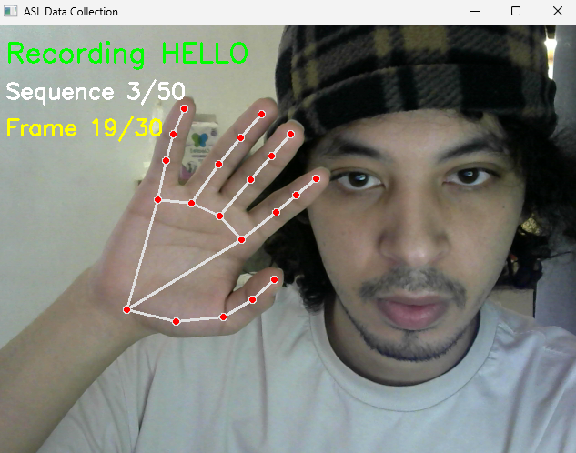
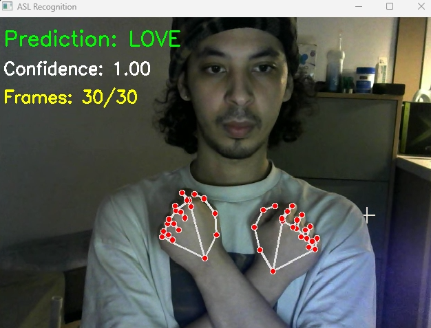

# ASL MediaPipe LSTM

Real-time American Sign Language recognition using MediaPipe Hands and a stacked LSTM neural network. Achieves **99.15% accuracy** across 12 gesture classes on a standard webcam — no GPU or depth sensor required.

> Bachelor's Dissertation — Nanjing University of Science and Technology, 2026
> Author: Lahmidi Rida

---

## Demo

The system runs in real time from your webcam, overlaying hand landmarks and predicted gesture labels directly on the video feed.

| HELLO Gesture | LOVE Gesture |
|:---:|:---:|
|  |  |

---

## Recognized Gestures

| Gesture | Description |
|--------|-------------|
| HELLO | Open-hand wave at head height |
| YES | Closed fist nodding up and down |
| NO | Index finger wagging side to side |
| PLEASE | Flat hand rubbing circular motion on chest |
| THANK YOU | Flat hand moving from chin outward |
| HELP | Thumb-up hand lifted from open palm |
| FOOD | Bunched fingertips tapping toward lips |
| WATER | W-shape hand tapping toward lips |
| LOVE | Arms crossed over chest |
| MORE | Both hands tapping bunched fingertips together |
| STOP | Flat hand pushing forward firmly |
| NO SIGN | Idle / no gesture |

---

## How It Works

1. **MediaPipe Hands** detects and tracks 21 hand landmarks per hand in real time from a standard RGB webcam
2. Each frame is converted into a **126-dimensional feature vector** (2 hands × 21 landmarks × 3 coordinates)
3. A rolling buffer of 30 consecutive frames (~1 second) is passed to a **stacked LSTM model**
4. The model outputs a softmax probability over 12 gesture classes
5. A confidence threshold of 0.80 filters out uncertain predictions

---

## Model Architecture

| Layer | Type | Units |
|-------|------|-------|
| 1 | LSTM | 128 (return_sequences=True) |
| 2 | Dropout | 0.3 |
| 3 | LSTM | 64 |
| 4 | Dropout | 0.3 |
| 5 | Dense (ReLU) | 64 |
| 6 | Dense (Softmax) | 12 |

---

## Results

| Metric | Value |
|--------|-------|
| Test Accuracy | 99.15% |
| Macro Precision | 0.99 |
| Macro Recall | 0.99 |
| Macro F1-Score | 0.99 |
| Inference Latency | < 20ms |
| Training Time (CPU) | ~5 minutes |

---

## Project Structure

```
├── src/
│   ├── data_collection.py   # Collect gesture sequences from webcam
│   ├── train_model.py       # Train the LSTM model
│   ├── asl_recognition.py   # Run real-time recognition
│   └── utils.py             # Shared utilities
├── models/
│   ├── asl_sequence_model.h5
│   ├── class_names.npy
│   ├── training_accuracy.png
│   └── training_loss.png
├── data/                    # Collected gesture sequences (.npy)
├── requirements.txt
└── README.md
```

---

## Installation

```bash
# Clone the repository
git clone https://github.com/PLayboicarti-commits/asl-mediapipe-lstm.git
cd asl-mediapipe-lstm

# Create a virtual environment
python -m venv venv
venv\Scripts\activate  # Windows

# Install dependencies
pip install -r requirements.txt
```

---

## Usage

### 1. Collect gesture data
```bash
python src/data_collection.py
```
Enter the gesture name and number of sequences when prompted. Press **SPACE** to record each sequence.

### 2. Train the model
```bash
python src/train_model.py
```
Trains for 30 epochs and saves the model to `models/`.

### 3. Run real-time recognition
```bash
python src/asl_recognition.py
```
Opens your webcam. Press **Q** to quit.

---

## Requirements

- Python 3.9+
- Webcam
- No GPU required

Key dependencies:
- `mediapipe`
- `tensorflow`
- `opencv-python`
- `numpy`
- `scikit-learn`

Install all with:
```bash
pip install -r requirements.txt
```

---

## Author

**Lahmidi Rida**
Bachelor's Thesis — Software Engineering
Nanjing University of Science and Technology, 2026
